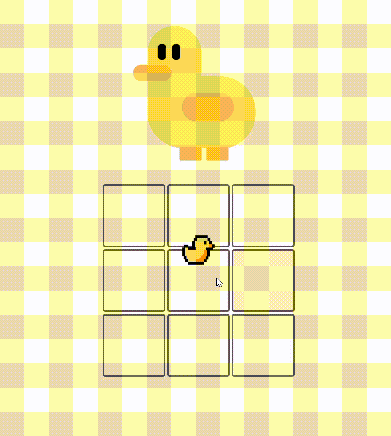

## Hello There! Lhes apresento: DuckDank

Um verdadeiro jogador de jogo da velha(Tic-Tac-Toy).
**Duck Dank** foi projetado para ter “vida própria” durante a partida, funcionando como um verdadeiro adversário no jogo da velha.

Você pode jogar clicando [aqui](lauandanobre.github.io/DuckDank/)

Em vez de utilizar uma lógica previsível, ou algoritmos como o **Minimax** o comportamento do DuckDank foi desenvolvido combinando diferentes algoritmos que tornam suas ações **dinâmicas, imprevisíveis e interativas** — simulando a tomada de decisões de um jogador real, com alguns erros por parte do pato, inclusive.

> A proposta do projeto é bem simples: criar um jogo da velha onde o adversário fosse o computador.
Mas.... para fugir do óbvio, tive a ideia de adicionar um personagem que interagisse com o jogador durante a partida,fazendo expressões, conversando ou lhe atrapalhando da maneira que puder.

## Com esse Projeto..
Explorei lógica de jogo e comportamento dinâmico em JavaScript,
utilizando para isso um personagem interativo para tornar a experiência mais
expressiva do que em um jogo da velha tradicional.

## Personagem e programação
O DuckDank atua como um **bot** que reage ao andamento do jogo.
Seu código inclui diversos algoritmos responsáveis por controlar desde a lógica das jogadas até as animações e efeitos visuais.

##### Principais funcionalidades implementadas:

- Algoritmo de controle do tempo de surgimento do miniDuck(O pato que ao clicado emite o som: Quak...)
- Algoritmo para análise das jogadas do usuário
- Algoritmos responsáveis pelas animações do DuckDank
- Execução de áudios dinâmicos conforme o estado do jogo
- Controle da animação final do personagem principal

Esses algoritmos combinados criam uma experiência mais viva e menos repetitiva para um jogo da velha comum.

## Evolução Visual
Para documentar o progresso do desenvolvimento, abaixo está a comparação entre a ideia inicial e o resultado final.

<table>
  <tr>
    <th>Ideia inicial do DuckDank</th>
    <th>Resultado final (dispositivo mobile padrão)</th>
  </tr>
  <tr>
    <td align="center">
      
    </td>
    <td align="center">
      
    </td>
  </tr>
</table>

## Considerações Finais
O DuckDank foi criado como um jogo simples que surgiu em minha mente durante uma viagem de ônibus, mas evoluiu para um algo capaz de misturar **lógica de jogo, interatividade, animação e personalidade.**
Acredito que o foco principal foi transformar uma mecânica clássica em algo mais envolvente e inesperado.

Isso é tudo... (:
